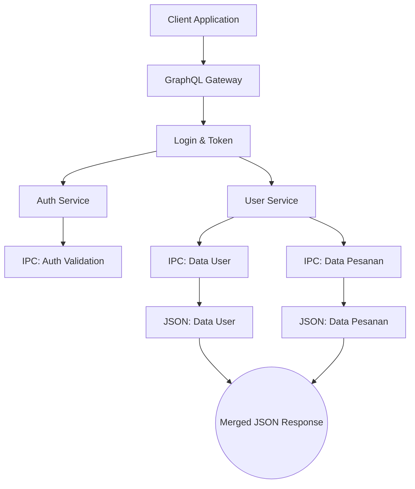

Nama    :    Naufal Fadlil Saputra
NIM    :    245410060

1. Teorema CAP dan BASE + Keterkaitan + Contoh
Teorema CAP

Teorema CAP (Consistency, Availability, Partition Tolerance) menyatakan bahwa pada sistem terdistribusi hanya dua dari tiga properti berikut yang dapat dijamin secara bersamaan:

• Consistency (C)

Semua node memiliki data yang sama pada waktu yang sama (strong consistency).

• Availability (A)

Setiap permintaan selalu mendapatkan respons, meskipun respons tidak selalu konsisten.

• Partition Tolerance (P)

Sistem tetap berfungsi meskipun terjadi gangguan atau putusnya jaringan antar node.

Karena partition selalu mungkin terjadi, maka sistem terdistribusi harus memilih:

CP → Konsisten, tapi jika jaringan terputus, sebagian layanan berhenti.

AP → Tetap tersedia, tapi data mungkin tidak konsisten sementara.

Teorema BASE

BASE adalah karakteristik sistem NoSQL dan kebalikan dari ACID.

Komponen BASE:
Komponen	Penjelasan
Basically Available	Sistem selalu memberi respons cepat
Soft State	Data tidak harus konsisten sepanjang waktu
Eventually Consistent	Konsistensi akan tercapai setelah beberapa waktu
Hubungan CAP dan BASE

BASE selaras dengan model AP dalam CAP:

Sistem tetap tersedia (Availability)

Sistem bertahan dari gangguan jaringan (Partition Tolerance)

Konsistensi diberikan belakangan (Eventually Consistent)

Contoh yang Saya Gunakan (Real Case)

Redis Cache

Ketika membaca data, Redis memberikan jawaban sangat cepat, meskipun data terkadang belum 100% sinkron dengan database utama. Artinya:

Redis mengutamakan Availability (A) + Partition Tolerance (P)

Konsistensi diperbaiki kemudian (eventual consistency)

Ini adalah contoh nyata hubungan CAP (AP) dan BASE.

2. Keterkaitan GraphQL dengan Komunikasi Antar Proses pada Sistem Terdistribusi
Hubungan GraphQL dengan IPC (Inter-Process Communication)

GraphQL bukan hanya query language untuk API, tetapi juga dapat digunakan sebagai protokol komunikasi antar layanan dalam sistem terdistribusi.

GraphQL memperbaiki komunikasi IPC dengan cara:
1. Contract-Based Communication

GraphQL memiliki schema → layanan lain dapat mengetahui struktur data secara pasti.
Ini memudahkan koordinasi antar microservices.

2. Mengurangi Chatty Communication

Tanpa GraphQL, proses sering melakukan banyak GET ke berbagai endpoint REST.
Dengan GraphQL → satu query dapat mengambil berbagai data sekaligus.

3. Typed Communication (Schema)

GraphQL menggunakan tipe data yang jelas, sehingga cocok untuk komunikasi antar proses yang memerlukan struktur data stabil.

4. Mendukung Query Fleksibel Antar Layanan

Setiap layanan hanya mengirim data yang diminta, bukan seluruh response (seperti REST).

3. Dengan menggunakan Docker / Docker Compose, buatlah streaming replication di PostgreSQL yang bisa menjelaskan sinkronisasi. Tulislah langkah-langkah pengerjaannya dan buat penjelasan secukupnya.

   .github/workflows/replication.yml

   name: PostgreSQL Streaming Replication Demo

on:
  workflow_dispatch:

jobs:
  run-replication:
    runs-on: ubuntu-latest

    steps:
      - name: Checkout Repository
        uses: actions/checkout@v3

      - name: Create docker-compose.yml
        run: |
          cat << 'EOF' > docker-compose.yml
          version: '3.9'

          services:
            postgres-primary:
              image: postgres:15
              container_name: postgres-primary
              environment:
                POSTGRES_PASSWORD: password
                POSTGRES_USER: postgres
                POSTGRES_DB: mydb
              ports:
                - "5432:5432"
              command: >
                bash -c "
                  echo 'wal_level=replica' >> /var/lib/postgresql/data/postgresql.conf &&
                  echo 'max_wal_senders=10' >> /var/lib/postgresql/data/postgresql.conf &&
                  echo 'max_replication_slots=10' >> /var/lib/postgresql/data/postgresql.conf &&
                  docker-entrypoint.sh postgres
                "

            postgres-replica:
              image: postgres:15
              container_name: postgres-replica
              environment:
                POSTGRES_PASSWORD: password
                POSTGRES_USER: postgres
              depends_on:
                - postgres-primary
              ports:
                - "5433:5432"
              command: >
                bash -c "
                  rm -rf /var/lib/postgresql/data/* &&
                  PGPASSWORD=password pg_basebackup -h postgres-primary -D /var/lib/postgresql/data -U postgres -Fp -Xs -P -R &&
                  docker-entrypoint.sh postgres
                "
          EOF

      - name: Start Docker Services
        run: docker-compose up -d

      - name: Wait for PostgreSQL to Initialize
        run: sleep 20

      - name: Test Replication - Insert Data on Primary
        run: |
          docker exec postgres-primary psql -U postgres -c "CREATE TABLE test_rep(id INT, data TEXT);"
          docker exec postgres-primary psql -U postgres -c "INSERT INTO test_rep VALUES (1, 'Halo dari PRIMARY');"

      - name: Test Replication - Check Data on Replica
        run: |
          docker exec postgres-replica psql -U postgres -c "SELECT * FROM test_rep;"

   
